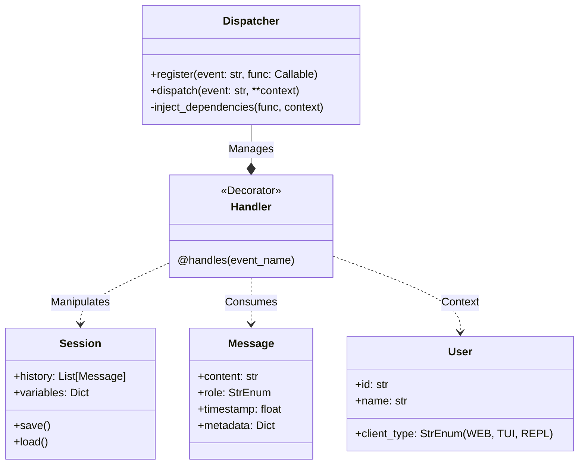

# Architecture: High Level

**Context:** The system architecture for Aigent V2, built on an Event-Driven Core.

---
**Alignment:**
*   [Core Principle: Unified Client-Server](../../core/PRINCIPLES.md#unified-client-server-architecture)
*   [Core Principle: Event-Driven Architecture](../../core/PRINCIPLES.md#event-driven-architecture)
---

## System Overview

The system is composed of a central **Daemon** (Server) and multiple **Thin Clients**. All logic resides in the Daemon, orchestrated by an **Event Bus**.

```mermaid
graph TD
    subgraph "Clients (Thin)"
        CLI[CLI (TUI/REPL)] <-->|WebSocket| API[Server API]
        Web[Web UI] <-->|WebSocket| API
    end

    subgraph "Server Daemon"
        API <-->|Pydantic Ingest| Bus[Event Bus]
        
        Bus -->|Dispatch| H_LLM[LLM Service]
        Bus -->|Dispatch| H_Tools[Tool Executor]
        Bus -->|Dispatch| H_Auth[Authorizer]
        Bus -->|Dispatch| H_Sess[Session Manager]
        
        H_LLM -->|Event: token| Bus
        H_Tools -->|Event: result| Bus
        H_Sess -->|Event: state_change| Bus
    end
```

## The Event Bus (The Core)

The **Event Bus** (`src/aigent/core/events.py`) is the singleton responsible for application flow. It uses the [Handles Pattern](../PATTERNS.md#1-the-handles-pattern-for-event-driven-architecture) to route events.

### Component Interaction

1.  **Ingest:** The Server API receives a raw message (JSON) from a WebSocket.
2.  **Validation:** The API validates the JSON against a **Pydantic Model** (e.g., `ClientInputSchema`).
3.  **Objectify:** The API converts the Pydantic model into rich Objects (`User`, `Message`, `Session`).
4.  **Dispatch:** It calls `bus.dispatch(CoreSignal.CLIENT_INPUT, user=UserObj, message=MessageObj)`.
5.  **Route:** The Bus inspects registered handlers.
6.  **Inject:** The Bus injects dependencies.
    *   *Handler:* `def on_chat(user: User, message: Message)`
    *   *Injection:* Matches `User` type to `UserObj`. Matches `Message` type to `MessageObj`.
7.  **Execute:** The handler runs.

## Data Persistence

*   **Sessions:** Stored as JSON files in `~/.aigent/sessions/`.
*   **Crash Dumps:** Stored as Pickled state files in `~/.aigent/crashes/`.
*   **Logs:** Rotating log files in `~/.aigent/logs/`.

## Class Structure


